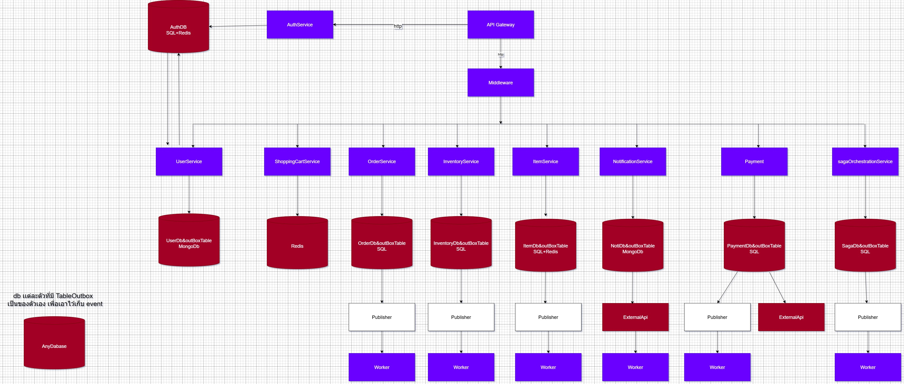
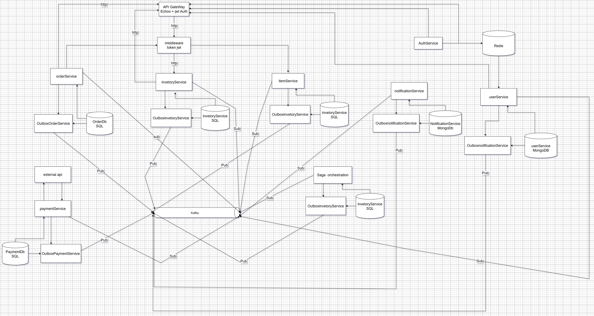

# 🛒 ecom-micro

Microservices eCommerce Project (Learning Purpose)

## 📌 Description
โปรเจกต์นี้เป็นการออกแบบระบบ eCommerce แบบ Microservices โดยแต่ละ Service มี Database แยกของตัวเอง (ตามหลัก Database per Service)  
ใช้ **Event-Driven Architecture** ผ่าน **Kafka** และรองรับการจัดการธุรกรรมข้าม Service ด้วย **Outbox Pattern + Saga Orchestration**

---

## ⚙️ Services Overview

### 🔐 Auth Service (MongoDB)
- เก็บข้อมูล Credential และการยืนยันตัวตน
- ออก JWT token ให้กับ User
- ใช้ **MongoDB** เพราะข้อมูล User/Auth มีโครงสร้างยืดหยุ่น และอาจต้องขยายเพิ่ม Field ใหม่ ๆ ได้ง่าย

---

### 👤 User Service (MongoDB)
- จัดการข้อมูลโปรไฟล์ผู้ใช้ (เช่น ชื่อ, อีเมล, เบอร์โทร)
- ใช้ **MongoDB** เช่นเดียวกับ Auth เพื่อความสะดวกในการจัดเก็บข้อมูลที่เปลี่ยนแปลงบ่อยและยืดหยุ่น
- ทำงานร่วมกับ Redis (Cache) เพื่อลดภาระการ Query User บ่อย ๆ

---

### 📢 Notification Service (MongoDB)
- ส่งการแจ้งเตือน (อีเมล, SMS, push notification)
- ใช้ **MongoDB** สำหรับเก็บประวัติการส่ง Notification
- รับ Event จาก Kafka เช่น `order_created`, `payment_success`, `order_failed`

---

### 🛒 Order Service (PostgreSQL)
- สร้างและจัดการคำสั่งซื้อ
- เก็บสถานะ Order เช่น `PENDING`, `PAID`, `CANCELLED`
- ใช้ **Outbox Pattern** เพื่อบันทึก Event (เช่น `order_created`) ลง Outbox table ก่อนส่งไป Kafka
- Database → **PostgreSQL** เหมาะกับข้อมูลเชิงโครงสร้างและการใช้ Transaction

---

### 📦 Inventory Service (PostgreSQL)
- จัดการ Stock ของสินค้า
- เมื่อ Order ถูกสร้าง → ตรวจสอบและลด Stock
- หาก Stock ไม่พอ → ส่ง Event `inventory_failed` ไป Kafka
- Database → **PostgreSQL** เพราะต้องการ Transaction ที่เข้มงวด (ACID) ป้องกัน Stock ลบผิดพลาด

---

### 💳 Payment Service (PostgreSQL)
- จัดการการชำระเงิน
- รับ Event `order_created` → พยายามตัดเงิน → อัปเดตสถานะเป็น `success` หรือ `failed`
- Database → **PostgreSQL** เพราะเหมาะกับระบบการเงินที่ต้องการความถูกต้องสูง

---

### 🔄 Saga Orchestration Service (PostgreSQL)
- ทำหน้าที่ **ประสานงานธุรกรรม (Saga Pattern)** ระหว่าง Service หลายตัว
- เก็บ **Saga State** เพื่อตรวจสอบว่าขั้นตอนใดสำเร็จ/ล้มเหลว
- ถ้ามีขั้นตอนล้มเหลว → ส่ง Event Rollback ไปยัง Service ที่เกี่ยวข้อง (Compensation Transaction)

---

### 📤 Outbox Pattern
- ใช้ใน Service ที่เขียน Event ลง DB ก่อน → แล้วจึงส่งออก Kafka แบบ async
- ป้องกันปัญหา **Lost Message** ระหว่าง DB กับ Kafka
- ตัวอย่าง: Order Service → เขียน `order_created` ลง Outbox → Worker อ่านทุก 5 วิ → ส่งเข้า Kafka มันจะดึงตัวใน outbox ที่ status เป็น pending

---

## 🛰️ Event Streaming (Kafka)
- ใช้ Kafka เป็น Event Bus ระหว่าง Service
- ตัวอย่าง Event:
  - `order_created`
  - `inventory_reserved`
  - `inventory_failed`
  - `payment_success`
  - `payment_failed`
  - `order_cancelled`
  - `notification_send`

---

## 🗄️ Database Choices

- **MongoDB** → Auth, User, Notification  
  👉 เพราะข้อมูลมีความยืดหยุ่น, ไม่ fix schema มาก, เน้นอ่าน/เขียนเร็ว

- **PostgreSQL** → Order, Inventory, Payment, Saga Orchestration, Outbox  
  👉 เพราะข้อมูลเหล่านี้ต้องการความถูกต้อง, การทำ Transaction แบบ ACID, การ Join และ Consistency ที่ชัดเจน

---

## 📊 topology Diagram

---
---

## 📊 EVENT FLOW

---

---

## 📊 System Diagram

---

## 📌 Status
- Code: in-progress
- Diagram: in-progress

---

## 📜 License
MIT License © 2023 Phattharakon Konkasem  
บางส่วนอ้างอิงจาก [hello-sekai-shop-microservices](https://github.com/Rayato159/hello-sekai-shop-microservices) (MIT License)
